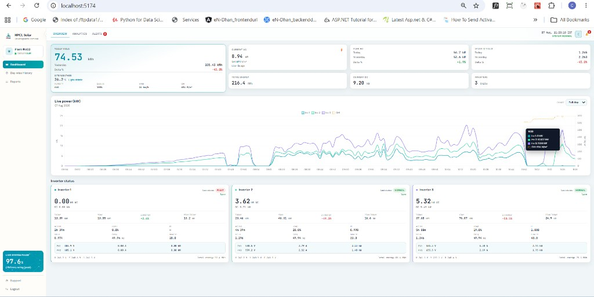
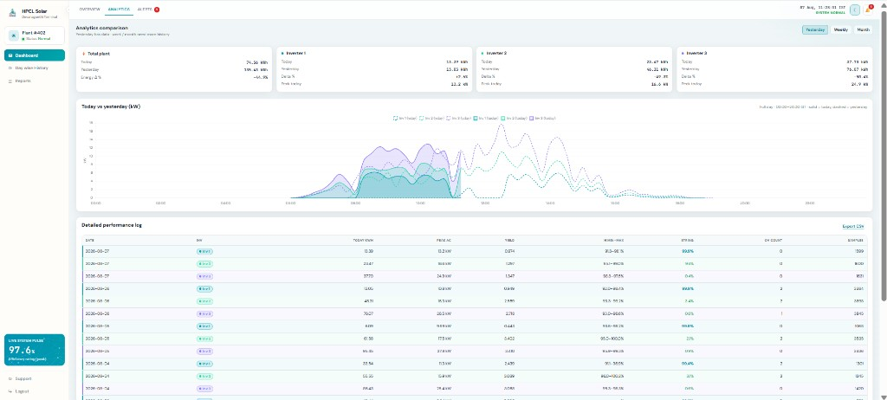
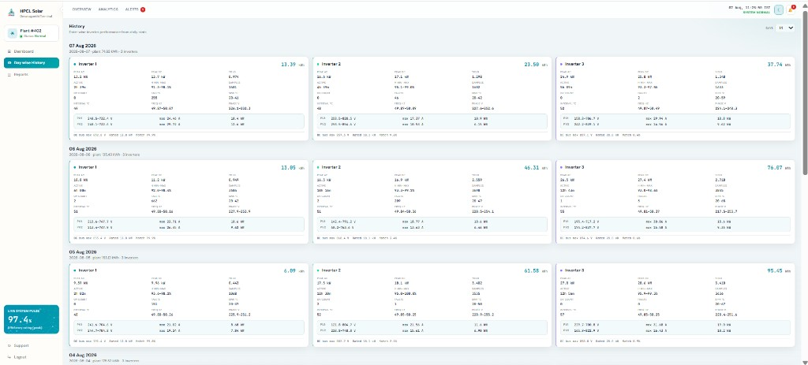

# HPCL Solar Dashboard

Live monitoring dashboard for HPCL EVVO solar inverters (**Plant #402**, Devanagonthi / Visakhapatnam Terminal). Reads Postgres tables for inverter telemetry, daily aggregates, and plant weather (GHI), and serves a React UI for overview, analytics, history, alerts, and reports.

Repository: [chanduamuluru/HPCL_Solar](https://github.com/chanduamuluru/HPCL_Solar)

**Stack**

| Layer | Tech | Default |
|-------|------|---------|
| API | FastAPI (`backend/`) | `http://127.0.0.1:8080` |
| UI | React + Vite (`frontend/`) | `http://127.0.0.1:5173` |
| DB | PostgreSQL (`hpcl_solar`) | via `DATABASE_URL` |
| Weather | Open-Meteo → `plant_weather` | GHI every ~30s |

---

## Screenshots

### Overview

Live KPIs, site weather (including GHI), live power chart with inverter series + radiance, and per-inverter status cards.



### Analytics

Today vs yesterday energy deltas, comparison chart, and exportable performance log.



### Day-wise History

Daily inverter performance cards (peak AC/DC, yield, PV strings, phase voltages, and more).



---

## Layout

```
HPCL_Solar / Hpcl_solarDashboard/
├── backend/                 # FastAPI API (:8080) — always run from here
│   ├── app/
│   ├── run.py
│   ├── requirements.txt
│   └── .env.example
├── frontend/                # React + Vite UI (:5173)
│   ├── src/
│   ├── public/img/
│   └── vite.config.js       # proxies /api → :8080 in dev
├── scripts/                 # ETL / sync / watch / aggregate
├── sql/                     # Schema for derived + weather tables
├── docs/screenshots/        # UI captures for docs
├── data/                    # Optional local data helpers
├── load_derived.py          # Thin wrapper → scripts.load_derived
└── README.md
```

> **Note:** Always start the API from `backend/` (`python run.py`). Do not use a legacy `app/` tree at the repo root if present — weather persistence and current routes live under `backend/app/`.

Field / site-visit assets (Modbus sniffers, status reports, `SitetapFile/`) may also live in this repository alongside the dashboard.

---

## Features

- **Overview** — Today yield, site weather + GHI, Current/Peak AC & DC, specific yield, live power chart (Inv 1–3 + GHI), inverter cards with PV string detail
- **Analytics** — Plant / inverter today–yesterday comparison, full-day IST chart, performance log + CSV export
- **Day-wise History** — Per-day inverter cards from `inverter_daily_stats`
- **Alerts** — Live + recent daily-derived alerts (fault / stale / anomaly cues)
- **Reports** — Tabular export views with inverter color coding
- **Weather / GHI** — Open-Meteo irradiance stored in `plant_weather`, shown on KPIs and chart tooltips
- **Stale feed policy** — Configurable `STALE_AFTER_SEC`; UI shows sample age while retaining last known power for display

---

## Setup

```powershell
cd backend
pip install -r requirements.txt
copy .env.example .env
# edit DATABASE_URL (and plant coords if needed)

cd ..\frontend
npm install
```

### Environment (`backend/.env`)

| Variable | Purpose | Typical |
|----------|---------|---------|
| `DATABASE_URL` | Postgres DSN | required |
| `HOST` / `PORT` | API bind | `0.0.0.0` / `8080` |
| `CORS_ORIGINS` | Allowed UI origins | Vite `5173` |
| `STALE_AFTER_SEC` | Feed stale window | `1200`–`1800` |
| `WEATHER_SAMPLE_SEC` | Persist weather interval | `30` |
| `PLANT_LAT` / `PLANT_LON` | Site coords for weather | Devanagonthi defaults |
| `PLANT_ID` | Weather row key | `402` |
| `PLANT_LABEL` | Display label | site name |

---

## Database schema

Apply from the **repo root** (requires `psql` and a writable DB role for DDL):

```powershell
# Derived telemetry + daily stats
psql $env:DATABASE_URL -f sql/recreate_derived_tables.sql
# or individual scripts:
#   sql/create_inverter_data_derived.sql
#   sql/create_inverter_daily_stats.sql

# Weather / GHI samples
psql $env:DATABASE_URL -f sql/create_plant_weather.sql
```

| Table | Role |
|-------|------|
| `inverter_data` | Raw Modbus / logger samples (source) |
| `inverter_data_derived` | Normalized live/history series for the API |
| `inverter_daily_stats` | Per-inverter daily aggregates |
| `plant_weather` | Plant GHI / weather snapshots (`UNIQUE (plant_id, ts)`) |

Backfill derived data:

```powershell
python -m scripts.load_derived backfill --and-aggregate
python -m scripts.load_derived verify
```

---

## Run (two terminals)

**Backend**

```powershell
cd backend
python run.py --port 8080
# health: http://127.0.0.1:8080/api/health
# OpenAPI: http://127.0.0.1:8080/docs
```

**Frontend**

```powershell
cd frontend
npm run dev
# → http://127.0.0.1:5173
```

Vite proxies `/api/*` to the backend. Optionally set `VITE_API_BASE=http://127.0.0.1:8080` or `?api=http://host:port`.

**Production UI build**

```powershell
cd frontend
npm run build
# serve dist/; set VITE_API_BASE at build time if the API is on another origin
```

---

## Loader / ETL commands

From repo root:

```powershell
python -m scripts.load_derived backfill --and-aggregate
python -m scripts.load_derived sync --since 1h --and-aggregate
python -m scripts.load_derived aggregate --date 2026-08-07
python -m scripts.load_derived verify
python -m scripts.load_derived repair-ts          # align derived received_at with raw
python -m scripts.load_derived watch --since 2h   # poll raw → derived (interval ≥ 2s)
```

`sync` / `watch` copy missing or mismatched rows from `inverter_data` into `inverter_data_derived`, matching on exact `ts` and preserving `received_at`. The lookback window uses `received_at` **or** `ts` so late-arriving batches are not skipped.

---

## API (high level)

| Endpoint | Description |
|----------|-------------|
| `GET /api/health` | Liveness |
| `GET /api/latest` | Plant + inverter snapshot (may refresh weather store) |
| `GET /api/series` | Time-bucketed power series (+ attached GHI) |
| `GET /api/weather` | Current site weather; upserts `plant_weather` |
| `GET /api/daily` / history routes | Day-wise and analytics aggregates |

See interactive docs at `/docs` when the API is running.

---

## UI map

| Nav / tab | What you see |
|-----------|----------------|
| **Dashboard → Overview** | KPIs, weather/GHI, live power chart, inverter cards |
| **Dashboard → Analytics** | Today vs yesterday cards + chart + performance log |
| **Dashboard → Alerts** | Grouped alerts (live + recent days) |
| **Day wise History** | Daily inverter performance cards |
| **Reports** | Tabular reports / CSV-oriented views |

Inverter colors (UI): Inv 1 teal, Inv 2 mint, Inv 3 purple. Chart tooltips show kW and GHI (W/m²) when available.

---

## Operations tips

1. Prefer `python -m scripts.load_derived watch` (or periodic `sync`) so derived stays close to raw.
2. If cards look empty but the chart has points, check stale window and that the API process is the **`backend/`** app (weather + latest GHI).
3. `repair-ts` fixes derived `received_at` when older loads stamped load-time instead of raw receive time.
4. Never commit `backend/.env` — only `.env.example` with placeholders.

---

## Field tools & site visit

This repository also holds plant-visit materials and Modbus/EVVO capture utilities used during site work:

- `evvo_decode.py`, `evvo_logger.py`, `modbus_sniff.py` — decode / log / sniff helpers
- `SitetapFile/` — raw and combined capture samples
- `HPCL_Green_Solar_Status_Report_V2.docx` / `.pdf` — status report documents
- `data/docs/` — register map and analysis notes for the dashboard

HPCL Green originally documented plant visit data, fetch codes, and observations; the live dashboard above builds on that telemetry pipeline.
